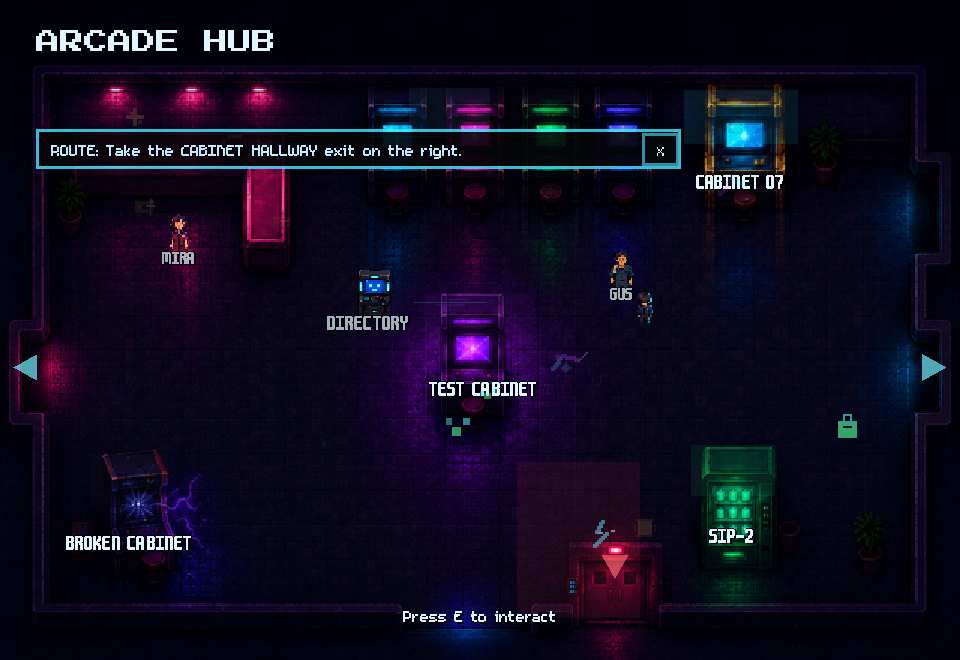
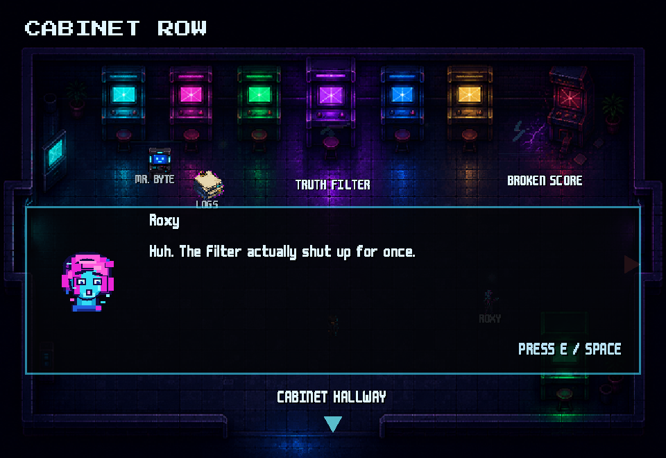
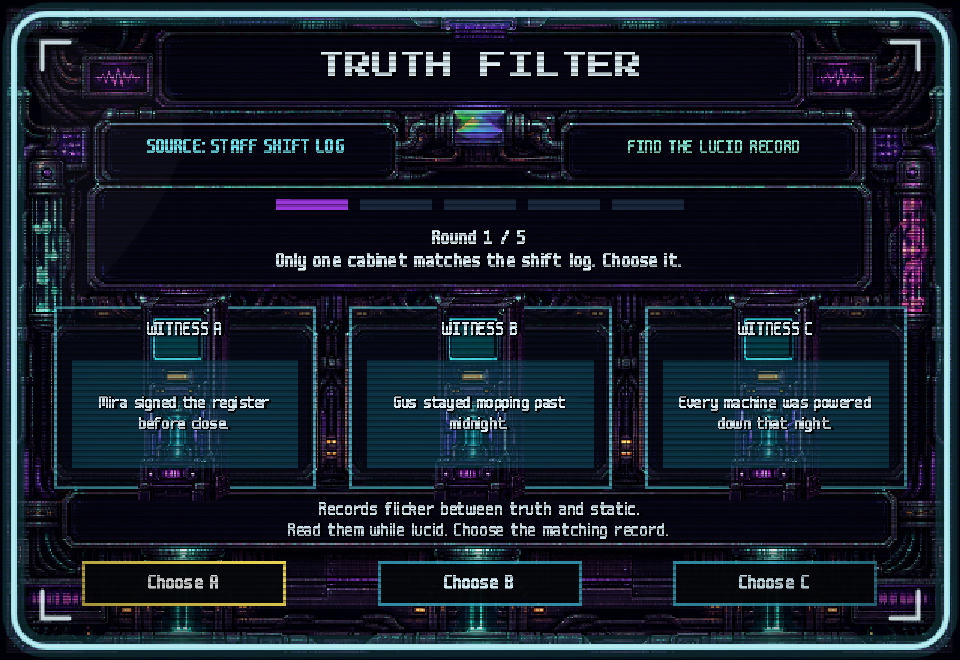

# The Last Token

The Last Token is a 2D top-down retro arcade mystery built in Godot 4.7 with GDScript. The player explores Pixel Haven after closing, talks to the arcade's regulars, recovers a lost token, works through eleven required quests and a roster of arcade stages, unlocks the staff room, and finds out who they actually are.



<p align="center">
  
  
</p>

<!-- These are rendered from the shipped game rather than hand-captured:
     godot --disable-crash-handler --path . --script "res://tools/capture_readme_shots.gd"
     writes them to tmp/captures/ at 960x660. See tools/capture_readme_shots.gd. -->

## Status

The game is complete and playable end to end. It was showcased at my university's IT club in July 2026, where roughly ten people played it, and I fixed the bugs that playtest surfaced.

What remains is minor polish:

- Exit placement between rooms.
- Adventure-stage level adjustments.

## Start here

If you have two minutes:

1. **Read [`scripts/GameState.gd`](scripts/GameState.gd) first.** `get_current_quest_id()` is the
   whole design in one function: the current objective is *derived* from more than a hundred
   named story flags every time it is asked for, rather than stored on a scene or advanced by a
   counter. Nothing in the game hard-codes what to do next — [`RouteCue.gd`](scripts/RouteCue.gd)
   and [`QuestNotice.gd`](scripts/QuestNotice.gd) render whatever that resolver returns.
2. **Then [`scripts/qa/RouteTraversalSmoke.gd`](scripts/qa/RouteTraversalSmoke.gd).** The rest of
   the suite proves the route is *wired*; this one proves it can be *walked*. It flood-fills each
   of the seventeen rooms from its spawn point using the real player body against the real
   physics world, then asserts every exit, every interactable and every other spawn marker lies
   in that one connected region.
3. **If you play only the first sixty seconds, spend them here.** Choose **New Memory**, talk to Mira
   at the ticket counter, and watch the route cue banner name the next objective: Cabinet 07,
   which launches Rockbyte Duel. That banner text is not authored per room — it is what the
   resolver in step 1 returned.

## Play it

Download the Windows x64 build from
[Releases](https://github.com/jdseo921/the-last-token/releases/latest). Unzip
`TheLastToken.exe` and `TheLastToken.pck` into the same folder and run the exe —
the `.pck` carries the game content and the exe will not start without it
alongside. No Godot install needed.

## What this demonstrates

- **Quest and flag progression.** Quest records are data, not code: [`data/quests.json`](data/quests.json) carries each quest's owner, location, `required` status, `starts_after` prerequisite and the Memory Signal it moves. [`scripts/GameState.gd`](scripts/GameState.gd) (1,589 lines) is the single autoloaded source of route truth, deriving the current objective from more than a hundred named flags on every call rather than storing it anywhere.
- **NPC and dialogue systems.** [`scripts/DialoguePool.gd`](scripts/DialoguePool.gd) serves line sets from [`data/dialogue/`](data/dialogue) first, random or sequential, with defined fallbacks when a file or key is missing. [`scripts/DialogueBox.gd`](scripts/DialogueBox.gd) drives the typewriter reveal and gives the antagonist speakers a separate scan-jitter presentation that ducks music through the AudioManager as it plays.
- **Minigame roster.** Eleven playable screens plus a template, enumerated once in [`scripts/qa/MinigameTestCatalog.gd`](scripts/qa/MinigameTestCatalog.gd) so pause, layout and UI-architecture coverage all inherit the same inventory. Presentation is shared rather than copied, and [`MinigameUILayoutGuard.gd`](scripts/ui/MinigameUILayoutGuard.gd) preserves authored rectangles, shrinking text only when changed copy would overflow them.
- **Save/load with spawn-marker-safe restores.** [`scripts/SaveManager.gd`](scripts/SaveManager.gd) writes three JSON slots and parses player files with a `JSON` instance rather than `JSON.parse_string()`, so a corrupt save is rejected quietly with logged context instead of raising engine errors. Restores avoid exact coordinates — transient scenes map back to the parent room that owns them and re-enter at a named spawn marker — and `GameState.apply_save_data()` back-fills prerequisite flags so saves written before the route was expanded keep loading.
- **Scene transitions.** [`scripts/SceneChanger.gd`](scripts/SceneChanger.gd) owns the fade overlay, a re-entrancy guard, named route constants and return-point capture, so a minigame can hand control back to the room that launched it. [`scripts/MapTransition.gd`](scripts/MapTransition.gd) arms itself only after the spawn frame, so a spawn overlapping an exit cannot bounce the player straight back out.
- **Audio management.** [`scripts/AudioManager.gd`](scripts/AudioManager.gd) pools SFX players and runs two music players for crossfades, mapping a context id — room, stage or story phase — to a track. It dims music while the unknown voice speaks and re-reads volumes from [`scripts/GameSettings.gd`](scripts/GameSettings.gd) whenever settings change.
- **In-editor debug and diagnostic tooling.** [`scripts/DebugLog.gd`](scripts/DebugLog.gd) is a structured session trace — categorised events to `user://logs`, a 250-entry ring buffer, `F9` and `F8` overlays — that raises an `invalid_route_state` error automatically when GameState reports an impossible flag combination. [`scripts/Debug.gd`](scripts/Debug.gd) is a compile-safe bridge to it, so isolated `--script` QA runs do not depend on autoload symbols.

Full detail for every bullet above — the file-by-file breakdown, `CHARACTER_FILES`, the eleven screen names, the shared adventure movement FSM, `DevRouteMenu`, and the 49 utilities under [`tools/`](tools) — is in [`docs/ARCHITECTURE.md`](docs/ARCHITECTURE.md).

## QA automation

[`scripts/qa/`](scripts/qa) holds 35 automated checks plus a shared scene inventory (36 files, 5,056 lines), driven by one PowerShell entry point.

```powershell
pwsh tools/RunRegressionSuite.ps1
```

[`tools/RunRegressionSuite.ps1`](tools/RunRegressionSuite.ps1) runs an editor-wide parse precheck, boots the main scene, then executes all 35 sequentially in headless Godot. It does not trust exit codes alone: every log is scanned for `SCRIPT ERROR: Parse Error`, `SCRIPT ERROR: Compile Error`, `Failed to load script`, and `Failed to instantiate an autoload`, so a silent compile failure still fails the run.

Three of the things it asserts, with the real engine running:

- Every `MapTransition` target scene *and* target spawn marker exists, in both directions, across all seventeen rooms.
- Every dialogue line in the shipped data fits the real DialogueBox text rect at the real font size, so changed copy cannot quietly overflow it.
- Save to summary to reload round-trips, and deliberately corrupted save files fail safely.

The five-category breakdown, the per-check log paths, and the boundary — headless checks cover structure, data, state and layout, not movement feel, input timing or readability — are in [`docs/QA_AUTOMATION.md`](docs/QA_AUTOMATION.md). Those last three are verified by playing the game.

## Project scale

Measured from tracked files at the current commit:

| | Files | Lines |
| --- | ---: | ---: |
| Game and UI GDScript (`scripts/`, excluding `scripts/qa/`) | 70 | 19,020 |
| QA GDScript (`scripts/qa/`) | 36 | 5,056 |
| Tooling GDScript (`tools/`) | 49 | 5,376 |
| **Total GDScript** | **155** | **29,452** |

Also 49 `.tscn` scenes, 13 JSON data files (quests, dialogue, minigame config, asset manifest), and 2 PowerShell runners.

## Engine

- Godot 4.7.stable (`project.godot` lists the `4.7` feature tag).
- Main scene: `res://scenes/main/Main.tscn`.
- Fixed 640x440 viewport, `canvas_items` stretch, no Camera2D — each room is one screen.
- Nine autoloads: `DebugLog`, `GameState`, `SceneChanger`, `SaveManager`, `AudioManager`, `DisplayOptions`, `GameSettings`, `ConscienceEncounterDirector`, `DevRouteMenu`.

## Open the project

1. Install Godot 4.7.
2. Open Godot's Project Manager.
3. Choose `Import`.
4. Select this folder's `project.godot`.
5. Open the project.

## Run the game

1. Open the project in Godot.
2. Press Play.
3. If prompted for a main scene, choose `res://scenes/main/Main.tscn`.

## Windows export

`export_presets.cfg` at the repo root is configured for Windows Desktop and excludes `tools/`, `tmp/`, `docs/`, `*.md`, and `scripts/qa/` from the shipped build.

```
godot --headless --path . --export-release "Windows Desktop" build/windows/TheLastToken.exe
```

That writes `TheLastToken.exe` plus `TheLastToken.pck` — ship both together. `build/` is gitignored. Full build notes, including export templates, are in [`docs/BUILD.md`](docs/BUILD.md).

## Controls

Input actions are registered at runtime from `ACTION_BINDINGS` in [`scripts/GameState.gd`](scripts/GameState.gd) rather than from the project input map.

- Move: `WASD` / Arrow Keys
- Interact / Continue / Jump: `E` / `Space`
- Crouch: `S` / `Down`
- Cancel / Back / Pause: `Esc` / `Backspace`
- Menus: mouse click or keyboard focus

Window size is an in-game setting (Settings -> Display -> Window Size) offering `640 x 440`, `960 x 660`, and `1280 x 880`, persisted to `user://display.cfg`. Settings also covers master, SFX, and music volume, dialogue box opacity, and text speed.

## Core gameplay loop

Explore the arcade, talk to Mira and the other regulars, play the required arcade stages, investigate the closing-shift records, restore service power, assemble the Security Tape, stabilize the Memory Echo, enter the Staff Room, watch the reveal slideshow, and continue into post-reveal roam.

The required chain in [`data/quests.json`](data/quests.json) runs:

1. Recover the Lost Token — Mira / Cabinet 07 — Rockbyte Duel
2. Broken High Score — Roxy — Cabinet Row
3. Truth Filter — Mr. Byte — Cabinet Row
4. Route the Signal — Vendo — Circuit Soda
5. Prize Echo Ascent — Pip — Prize Corner
6. Closing Shift Echoes — Gus — lore investigation, no minigame
7. Static Service Run — Gus — Maintenance Hall
8. Maintenance Sync — Gus — door puzzle
9. Enter the Staff Corridor — Staff Door
10. Assemble the Security Tape — Staff Room
11. Stabilize the Memory Echo — Staff Room
12. Staff Room reveal, ending prompt, post-reveal roam

Three quests are optional: the Night Ledger archive run, the staff records chain, and the post-reveal witness route. Conscience encounters are short dialogue interludes between required beats, not stages.

`GameState` tracks required progress as a twelve-milestone count (`TOTAL_REQUIRED_PROGRESS_COUNT`), which is deliberately not a one-to-one map of the list above. [`docs/MINIGAME_ROSTER.md`](docs/MINIGAME_ROSTER.md) lists the counted flags in order and explains both discrepancies.

## Save files

The Esc pause menu opens save and load across three slots, stored as `user://saves/slot_1.json`, `slot_2.json`, and `slot_3.json`. Each slot in the menu shows its slot number, story phase, and last-saved timestamp; live quest counters were deliberately removed from the slot text so the list does not change shape as the player progresses. Loads restore through safe scene spawn markers instead of exact player coordinates.

## Dev route checkpoints and debug overlays

The route checkpoint menu is disabled by default and only builds itself in a debug or editor run. Enable it with `--dev-route-menu`, `THE_LAST_TOKEN_DEV_ROUTE_MENU=1`, or the `the_last_token/dev_route_menu_enabled` project setting, then press `F10` to jump to one of ten route checkpoints. Do not enable it for normal play or exports.

In the same debug builds, `F9` prints a route snapshot and `F8` prints the recent structured event buffer plus the session log path. [`docs/DEBUGGING.md`](docs/DEBUGGING.md) lists the event categories.

## Current placeholders

- Some map and character visuals are still simple shapes and labels. Route cues point at the next required room or local action, and small ambient sprite effects carry cabinet, static, and exit signals.
- The Staff Room reveal uses eight mono-color 8-bit panels under `assets/art/cutscenes/memory_reveal/`. The slideshow falls back to a `MEMORY PANEL / Placeholder image pending` card if an image is removed.
- Sixteen music tracks are wired through `AudioManager`; the sixteen SFX are simple generated WAV one-shots.
- Exact player position restore is intentionally not implemented. Story state, safe scene paths, and safe spawn markers are restored instead.
- Rockbyte Duel uses simple cabinet AI, so a win may take a retry.
- Generated polish assets are deterministic and project-local. The generators live under `tools/` and cover reveal panels, hub and minigame sprites, ambient effect sheets, stage backgrounds, and the WAV one-shots.

## Documentation

Design, content, QA, and build documents live in [`docs/`](docs). Start at [`docs/README.md`](docs/README.md) for the index, or [`docs/STORY_CANON.md`](docs/STORY_CANON.md) for the current story source of truth. [`AGENTS.md`](AGENTS.md) holds the working rules the project was built under.

## Intellectual Property & Usage

This repository contains personal portfolio code for employment review. All rights are reserved by the author. No permission is granted for commercial reuse, redistribution, or modification.

The reservation above covers the original work in this project: the GDScript under `scripts/` and `tools/`, the scenes and themes, the data files, the PowerShell runners, the project configuration, and the documentation under `docs/`. It does not extend to third-party material bundled so the game runs, which remains subject to its owners' terms — the fonts under `assets/fonts/`, which carry their own upstream licenses and attribution requirements listed in [`docs/FONT_CREDITS.md`](docs/FONT_CREDITS.md), and the Godot Engine, which is licensed separately by its authors and is not distributed here.
